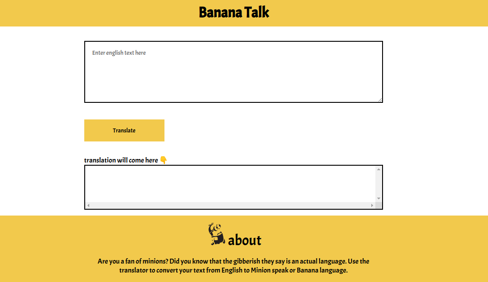

# neoG - Mark-6 Minion Speak

This is a solution to the [Mark-6 of neoG camp](https://neog.camp/guide/lesson-four#assignment).

## Table of contents

- [Overview](#overview)
  - [The challenge](#the-challenge)
  - [Screenshot](#screenshot)
  - [Links](#links)

## Overview
-Make a translation web app that will translate your sentences into Banana language.

### The challenge

- Attaching events to HTML elements
- Taking user input in browser
- selecting html elements using querySelector()
- Showing ouput in browser
- Making network calls to get relevant data, using fun translations API
- Error handling network calls

### Screenshot

### Links

[- Live Site URL](https://git-0r.github.io/mark6_translationApp/)
